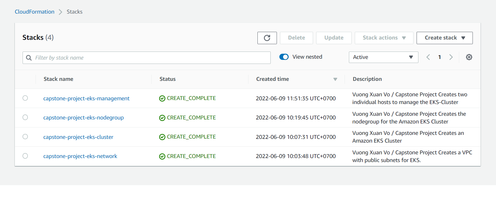
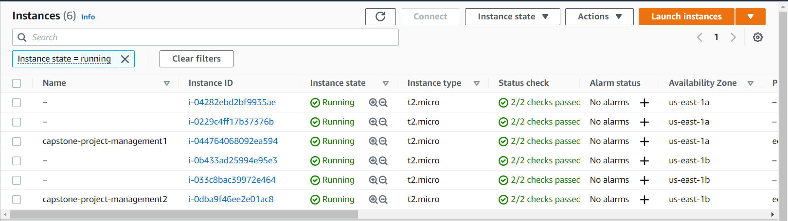
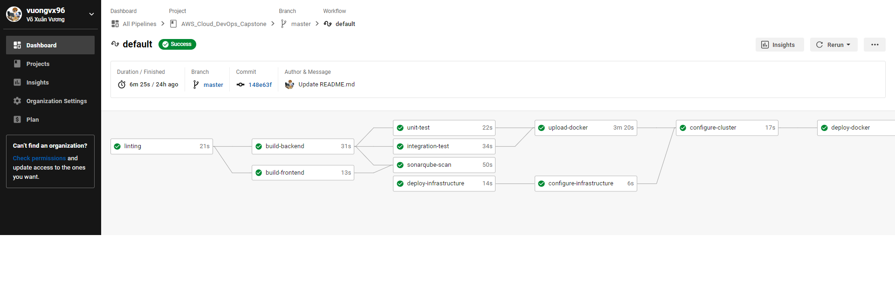

# Capstone Project For Udacity Cloud DevOps Nanodegree

<h3 align="center">Continuous deployment pipeline to deploy ASP.NET Core Application to AWS EKS cluster using CircleCI</h3>

This is a CI/CD pipeline using CircleCI that automatically deploy ASP.NET Core Application to EKS Cluster.

  
  
  
  

## Project Tasks

---
The project's goal is to apply the skills and knowledge that I developed throughout the Cloud DevOps Nanodegree program. In this project I did:

* Working in AWS
* Using CircleCI to implement Continuos Integration and Continuos Deployment
* Building pipelines
* Working with Ansible and CloudFormation to deploy clusters
* Building Kubernetes clusters
* Building Docker containers in pipelines

## Tech Stack

---
| Technology | Description                                                                           | Link ↘️                 |
| ---------- | ------------------------------------------------------------------------------------- | ----------------------- |
| AWS        | Online platform that provides scalable and cost-effective cloud computing solutions   | <https://aws.amazon.com//>      |
| C#         | High Level, Mutli-paradigm, Compiled Language                                         | <https://docs.microsoft.com/en-us/dotnet/csharp/> |
| .NET 6.0   | The merger of .NET Framework and .NET Core, Open source, Cross platform | <https://docs.microsoft.com/en-us/dotnet/>  |
| Docker     |  Open platform for developing, shipping, and running applications | <https://docs.docker.com/> |
| Kubernetes | Open-source system for automating deployment, scaling, and management of containerized applications | <https://kubernetes.io/>    |
| Ansible    | IT automation tool that automates cloud provisioning configuration management, application deployment, infra-service orchestration and many other IT needs                                                          | <https://www.ansible.com/>      |
| CircleCI    | Continuos integration & delivery platform that helps the development teams to release code rapidly and automate the build, test, and deploy               | <https://circleci.com/>      |

## Requirements

1. Create the CircleCI account
2. Create a Github repository
3. Set up a Dockerhub account and repository
4. Create an AWS - IAM user with the policies suggested on the official eksctl website as [Minimum IAM policies](https://eksctl.io/usage/minimum-iam-policies/)

## Application

## Kubernetes Cluster

I used AWS Cloudformation to deploy the Kubernetes Cluster. I have researched and customized based on these templates and documents:

* [amazon-eks-fully-private-vpc.yaml](https://amazon-eks.s3.us-west-2.amazonaws.com/cloudformation/2020-06-10/amazon-eks-fully-private-vpc.yaml)
* [amazon-eks-nodegroup.yaml](https://s3.us-west-2.amazonaws.com/amazon-eks/cloudformation/2020-10-29/amazon-eks-nodegroup.yaml)
* [AWS EKS: Managed setup with CloudFormation](https://medium.com/@dhammond0083/aws-eks-managed-setup-with-cloudformation-97461300e952)

I decided to split it into 4 cloudformation stacks:

* **Network**, create network infrastructure that the the EKS cluster will reside in.
* **EKS (Elastic Kubernetes Service)** for deploying a Kubernetes cluster.
* **NodeGroup** is used to create actual worker nodes. For greater security, these nodes are linked to private subnets.
* **Management** is needed to configure and manage the EKS Cluster and its deployments and services. These EC2 instances are connected to public subnets. Also used to connect and troubleshoot issues that happen in worker nodes (private subnets).

### List of deployed stacks

### List of deployed EC2 Instances

### Commands that are used to configure and deploy applications on an EKS cluster

After deploying the infrastructure, I used Ansible to configure management hosts.

1. Install AWS CLI and Kubectl.

2. Run `aws eks update-kubeconfig --region <<region-code>> --name <<cluster name>>` to fetch kubectl config

3. Run `kubectl apply -f <<path to defined resource template.yaml>>` to create Kubernetes resouces

4. Run `kubectl set image deployments/<<deployment name>> <<container name>>=<<docker image>>` to apply new docker image for deployment

5. Run `kubectl rollout status deployments/<<deployment name>>` to check deployment status

6. Run `kubectl get svc <<name of service>>` to view information of service

## CircleCI - CI/CD Pipelines

I have used CircleCI to define pipelines including:

* Linting
* Code building
* Unit testing
* Integration testing
* Build and push docker image to Docker Hub
* Slack notify when pipeline failed, deployment success

